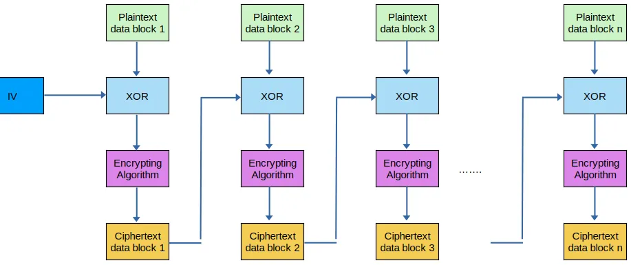
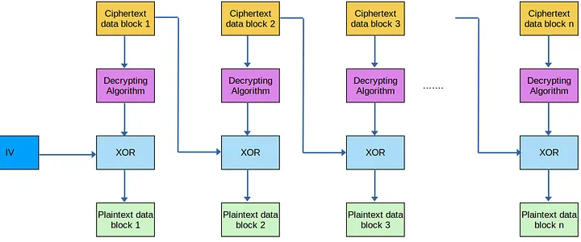
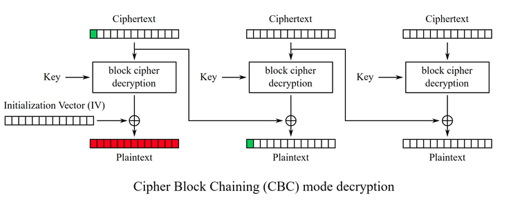

# Flip Room

This Room is about the Bit Flipping Attack in CBC (Cipher Block Chaining) Encryption mode.

## Description
The Room used AES algroithm in CBC mode for encrypton so that will be our focus.
Before we dive into how the attack works m we nned to first understand the algorithm.

### AES Overview

AES-CBC requires two things a KEY and an IV m we will get into what each one does in a minute. There is also a third parameter BLOCK_SIZE (16, 24, 32). You see before encrypting a data or a text, AES first split the text into blocks with thw same size. Block 1 = 16 . BLock 2 = 16 ....
if the length of data is not a multiple of BLOKC_SIZE , in other words in the last block cant have the same size as the others , we fill it with "random data" which we call padding.

### AES Encryption

To Encrypt a text we said that its been split to multiple blocks. Before Encryption each block there is an additional step which is a XOR operation.
Block n XOR Block n-1. (e.g: Block 2 XOR Block 1 ). Now there is a question Block 1 s the first block so there is nothing  before it what will it be XORed with ? Thats where the IV (Initialization Vector) comes in it is used to XOR the first block. after the XO operation AES then encrypt the data using the KEY defined.



### AES Decryption

The same thing goes for decryption. Split into blocks, decrypt the block, then XOR again.



## Bit Flipping Attack

### Overview

Let's say I have an encrypted text and in the first block I changed the value of the third byte, what will happen ?

The change will resut in 2 things :
First the decrypted first block will be in shambles m unreadable
Second the third byte in block 2 will be changed, and that is the core of the attack. Since the two blocks get XORed the I can change any value I want in block 2 by simply changing block 1.



Now lets say a program checks for privilege by validating a value "is_admin=0", all I have to do is change the block before in a specify position that will change the value of 0 into 1. ( I simplified it too much xD).

Since the program only checks for the value is_admin then the shambles in the block before dont matter.

### What Changes Should I Apply ??

Now we already now that if I want to changes a specifed value in a given block, I have to change to go to that exact position in the block before then change it. But what should I put in instead ??

Well that is the easy part. Let's take a look at this XOR operation

```python
    a ^ b = c
    # That implies that
    a = b ^ c and b = a ^ c

    # IN our case
    # current id = 0
    # desired id = 1
    # Change I should do is the XOR between these two values
    # So
    change = ord(0) ^ ord(1)

    # All we have to do now is go change it in the encrypted text by xoring again

    # Lets say the value I want to change is in postion 3
    # and I have a value ciphered_text
    value_to_change = ciphered_text[3:4]
    new_value = value_to_change ^ change
    new_encrypted_text = ciphered_text[:3] + bytes([new_value]) + ciphered_text[4:]
```

## Solution

The Solution for this room is as easy. When Connecteing to the server it asks for the username and password m we cant directly input the correct values 'admin' and 'sUp3rPaSs1'. So we have to enter a wrong data on purpose then alter with the ciphered text to change it to the correct one.

```python
# Correct Value
access_username=admin&password=sUp3rPaSs1

# Lets split them into blocks
access_username= | admin&password=s | Up3rPaSs1
    Block 1             Block 2         Blcok 3

# Since the prgoram only checks for the part "admin&password=sUp3rPaSs1"
# That means there is no problem altering with the first block
# Now The question is what data should we enter to make it easy to alter with it
# I chose
# username = xdmin
# password = Up3rPaSs1
# as u can see to make my data valid I only have to change the 'x' into an 'a'
```

and that is it

## Resources 

[CBC Bit-Flipping Attack By Mahmoud Jadaan](https://medium.com/@masjadaan/cbc-bit-flipping-attack-b92efafbb83d)
<br></br>
[Room WriteUp By 0xb0b](https://0xb0b.gitbook.io/writeups/tryhackme/flip)